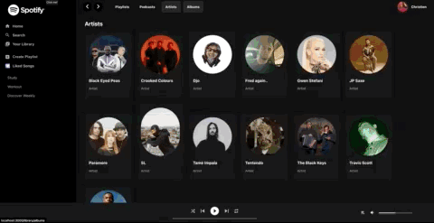
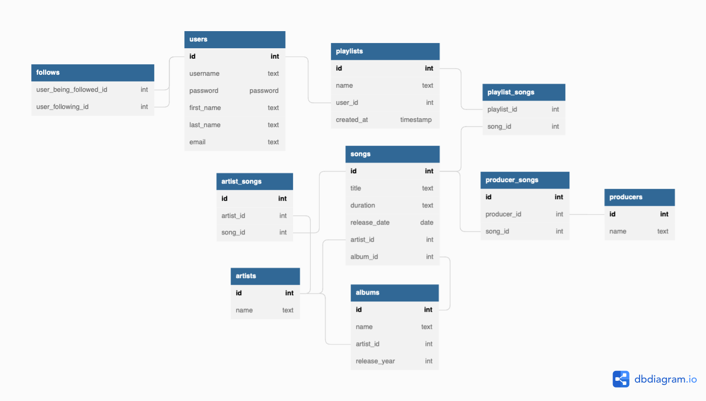

    

   
  

    Built with ❤︎ by <a href="https://github.com/cng008">Christien Ng</a>

 

    
    
    
    

# Spotify Clone

# :pushpin: **Table of Contents**

- [Live Website](#live-website)
- [Purpose and Features](#dart-purpose-and-features)
- [API](#thought_balloon-api)
- [Tech Stack](#computer-tech-stack)
- [How to Run](#construction_worker-how-to-run)

## **Live Website**

### 👉 [Click here to open website](http://cng008-spotify-clone.surge.sh)

---

# :dart: **Purpose and Features**

- Responsive clone of Spotify's Web Application.
- Collaborative playlists

The goal of this app is to make a simplified full-stack clone of Spotify’s desktop application UI using PERN stack technologies.

This application provides users a way to easily search Spotify's song database without any extra frills or ads.

## **User Flow & Features**

- Anyone can browse through the site, however, if a user wants to search and save songs to a playlist, they will need to be logged in.
<!-- - Users can log into the site using their Spotify account, which returns an access token to allow access to search songs using the Spotify API in the Search component 
- Logged in user's profile name and image shows in header and in playlists they create -->
- Allow (logged in) users to search tracks, artists, albums
- All users can view, add, edit, and delete playlists.
- Must log in if you want to access songs, Christien's Discover Playlist
- Use sessionStorage to keep the token and token expiry time in simple state. This way, when the page is loaded, it can first look for it there.
- Use sessionStorage to store Discover Weekly data (fixes Spotify API fetch issues with refreshing react app)
- View playlist details and all songs associated with it

\*player doesn't actually play music

##### Demo

##### Database Schema

---

## :thought_balloon: **API**

This application was created using data from the [Spotify API](https://developer.spotify.com/documentation/web-api/). All card details and images are sourced from the API's database.

#### External API Overview

> [https://developer.spotify.com/documentation/web-api/](https://developer.spotify.com/documentation/web-api/)

<!-- - `/v1/me` -->

- `/v1/playlists/<playlist-id>`
- `/v1/artists/<artist-id> `
- `/v1/search `

#### Internal API Overview

- Songs, Artists, Albums, Playlists, and Users are stored in the site's backend database (PostgreSQL)

## :computer: **Tech Stack**

This project was made using the following technologies:

- [HTML](https://developer.mozilla.org/en-US/docs/Web/HTML)
- [CSS](https://developer.mozilla.org/en-US/docs/Web/CSS)
- [Node.js](https://nodejs.org/en/)
- [PostgreSQL](https://www.postgresql.org)
- [Express](https://expressjs.com/en/4x/api.html)
- [JWT](https://www.npmjs.com/package/jsonwebtoken)
- [Axios](https://axios-http.com/docs/intro)
- [React](https://reactjs.org)
- [ReactDOM](https://reactjs.org/docs/react-dom.html)
- [Material UI](https://mui.com)
- [react-sliding-pane](https://www.npmjs.com/package/react-sliding-pane)
- [spotify-web-api-js](https://www.npmjs.com/package/spotify-web-api-js)
- [Jest](https://jestjs.io)
- [Supertest](https://github.com/visionmedia/supertest)
- [Morgan](https://www.npmjs.com/package/morgan)
- [Heroku](https://www.heroku.com)
- [Surge.sh](https://surge.sh)
- [VSCode](https://code.visualstudio.com/docs)

## :construction_worker: **How to Run**

### Go to [http://cng008-spotify-clone.surge.sh](http://cng008-spotify-clone.surge.sh)

##### OR

### Make PostgreSQL tables

    $ psql < spotify.sql

### Run Backend

    $ git clone https://github.com/cng008/spotify-web-player-clone.git
    $ cd backend
    $ npm i
    $ nodemon server.js
    $ cd ..

#### Unit Tests

    $ npm test

### Run Frontend

    $ cd frontend
    $ npm i --legacy-peer-deps
    $ npm start

#### Unit Tests

    $ npm test

## Challenges

There were many challenges figuring how to piece the frontend and backend together.

- Issue: keeping a user logged into their account so that they wouldn't be logged out of their spotify authentication on page refresh.
  - Resolution: Storing this data in the browser solved this issue.
- Issue: retrieving data from Spotify's API and figuring out how to save it to the backend while needing multiple requests for the data I needed
  - Resolution: saving data to useState when variables weren't accessible where needed or using state to get multiple api requests
- Issue: Users wanting to login using their irl Spotify account must be explicitly added under the section "Users and Access" by Christien before they can authenticate with the app (Spotify's rules)
  - Resolution: disable spotify authentication login method and replace with axios method to fetch token using basic authorization
- Issue: backend tests wouldn't pass when run together as `jest`
  - Solved: tests passing under `npm test`
- Issue: components that contain useContext hooks in the frontend are passing as undefined, therefore not passing unit tests
  - will revisit later
