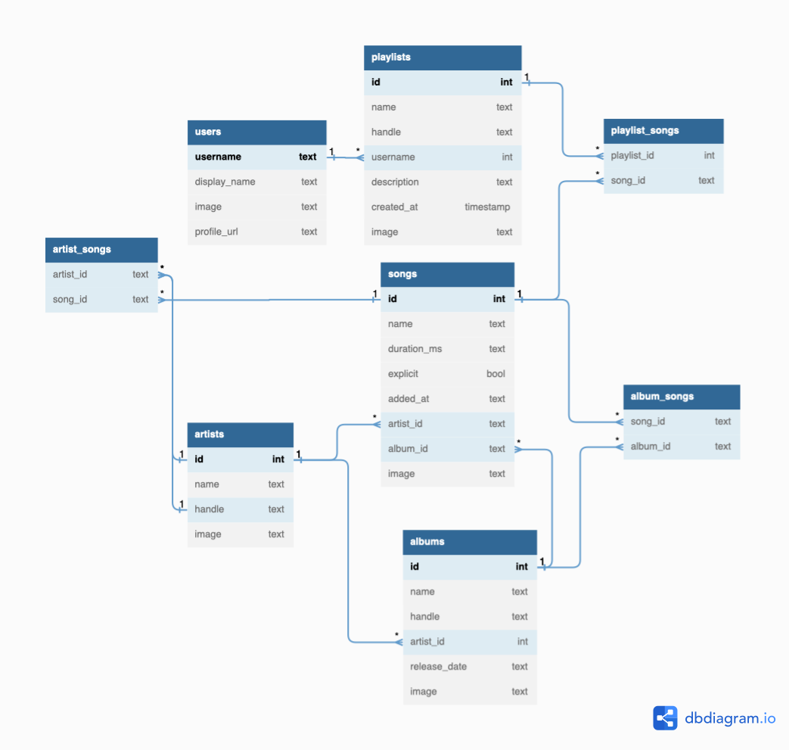

# Spotify Clone

## Overview

The number of Spotify users has been growing exponentially since its launch in 2008 with an anticipated [428 million monthly active users by the end of Q2 2022](https://www.demandsage.com/spotify-stats/). The purpose of this app is to make a simplified full-stack clone of Spotify’s desktop application UI using React/Node with a working music player.

The user demographic will include:

- a wide range of age groups
- visitors from all over the world
- anyone who loves music!

## Data Sources

The main source of the data will be provided by the [Spotify API](https://developer.spotify.com/documentation/web-api/) which will be used to stream music directly from the API.

## Database Schema

## Potential API Issues

Since the Spotify API is free and well-documented, the only potential API issue would be how to associate user’s playlist/song favorites when creating my own API. A challenge that may come up would be when creating a method to follow other users.

## Sensitive Information

- Encrypted passwords will be stored for the user model.
- An email address must be provided to identify a single user.
- Users do not need to enter first or last names, a username can be in place of this.

## Functionality

- Allow users to search for songs/artists/albums and make a playlist.
- Users can search for music and add/delete songs from their playlists. All users can view, add, edit, and delete from a public playlist.
- Upon clicking a result, there will be a page with more details about the song, album, and artist.
- View/search by lyrics.

## User Flow

- Landing/welcome page with login options.
- Users can log into their Spotify accounts using their authenticated methods of logging in where they’re able to see their playlists and play music straight from the application.
- Users without an account can sign up from the site as well.
- Anyone can browse through the site, however, if a user wants to save a song to a playlist, they will need to create an account and be logged in.
- Users can add songs to a pre-existing playlist, or they can create their own public or private playlist.

## Beyond CRUD

The CRUD aspect of the app revolves around the playlists and the user’s ability to add/remove songs or playlists from their account. The stretch goal is to create an exact replica of the Spotify desktop application on the web, CSS effects and all.

I may add my own playlists in the browse tab for the least listened-to songs on the platform AKA “Not On Your Radar”. Users can view lyrics to the song using the [Lyrics API](https://www.lyrics.com/lyrics_api.php), [Genius API](https://docs.genius.com), or [Musixmatch](https://developer.musixmatch.com/documentation?ref=apilist.fun).
